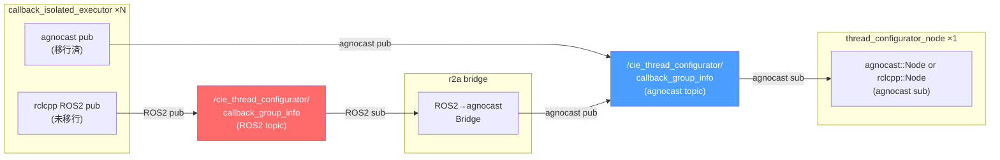
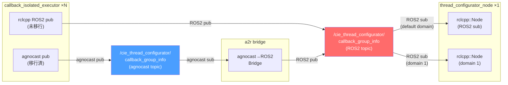
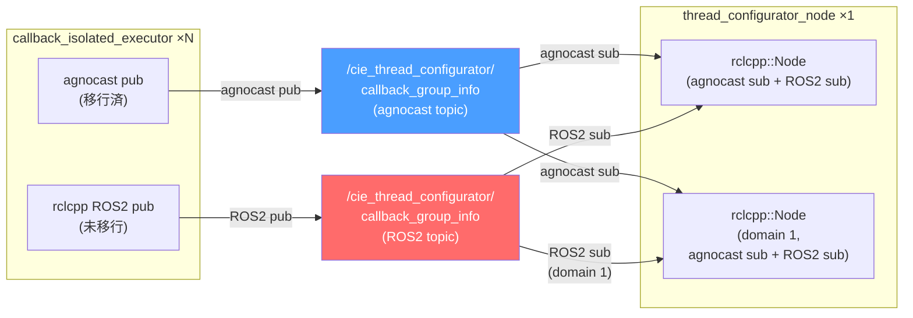
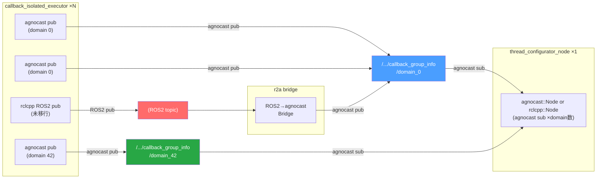
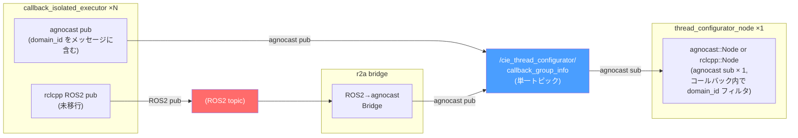

# thread_configurator_node (1) ↔ callback_isolated_executor (N) 通信方式の比較

## 前提

### Publisher 側 (callback_isolated_executor, N個)

- **現状**: `rclcpp::Node` ベース。agnocast publish を使用しているものと、ROS2 publish を使用しているものが**混在しうる**
- **最終形**: いずれ全て `agnocast::Node` → agnocast publish のみ
- 移行期間中は ROS2 pub と agnocast pub が共存する

### Subscriber 側 (thread_configurator_node, 1個)

- 選択の余地あり
- 現状、domain_id ごとに別 `rclcpp::Node` を作成して ROS_DOMAIN を分離している

### 制約まとめ

| 条件 | 詳細 |
|------|------|
| `agnocast::Node` | agnocast pub/sub のみ (bridge 経由で ROS2 通信は可能) |
| `rclcpp::Node` | ROS2 通信・agnocast 通信どちらも可能 |
| DDS participant | `rclcpp::Node` 生成時に作られる。起動時間のボトルネック |
| ROS_DOMAIN | agnocast は未サポート (domain が異なっても通信される) |
| レイテンシ | agnocast < ROS2 |
| ブリッジ | agnocast pub → ROS2 sub、ROS2 pub → agnocast sub のクロス通信が可能 |

---

## Option 1: agnocast sub のみ (現ブランチの方式)

**概要**: subscriber 側は agnocast subscription のみ。未移行の ROS2 publisher は r2a bridge 経由で agnocast に変換して受信する。全 publisher が agnocast に移行完了すれば bridge は不要になる。

| Pros | Cons |
|------|------|
| subscriber 側が `agnocast::Node` なら DDS participant 0 | 移行期間中は r2a bridge が必要 |
| 低レイテンシ (agnocast pub 同士は直接通信) | agnocast は ROS_DOMAIN 未サポート → domain_id の自前管理が必要 |
| 全 publisher の移行完了後は bridge 除去のみでクリーンな構成に | bridge 経由の ROS2 pub はレイテンシ増加 (2ホップ) |
| subscriber 側のコードが agnocast sub のみでシンプル | `agnocast::Node` の場合、ROS2 service/parameter が直接使えない |

**移行戦略**: publisher 移行完了 → bridge 除去。subscriber 側の変更不要。

---

## Option 2: ROS2 sub のみ

**概要**: subscriber 側は ROS2 subscription のみ。agnocast publisher は a2r bridge で ROS2 に変換して受信する。

| Pros | Cons |
|------|------|
| subscriber 側は純粋な `rclcpp::Node` → ROS2 エコシステム完全互換 | 移行が進むほど bridge 経由の通信が増える (最終的に全通信が bridge 経由) |
| per-domain `rclcpp::Node` で **ROS_DOMAIN ネイティブ対応** | 全 publisher 移行後も bridge が恒久的に必要 (除去不可) |
| 既存 ROS2 ツール (`ros2 topic echo` 等) でデバッグ可能 | レイテンシ増加 (agnocast pub → bridge → ROS2 sub) |
| thread_configurator に agnocast 依存不要 | DDS participant が domain 数 + 1 個生成される → 起動が遅い |
| 未移行 ROS2 publisher はそのまま動作 | bridge の domain_id ルーティングロジックが必要 |

**移行戦略**: bridge は恒久的に残る。subscriber 側の変更不要だが、最終構成に bridge が含まれ続ける。

---

## Option 3: Dual subscription (agnocast sub + ROS2 sub 併用)

**概要**: subscriber 側が同一トピックに対して agnocast subscription と ROS2 subscription の**両方**を持つ。bridge 不要で両方の publisher から直接受信できる。

| Pros | Cons |
|------|------|
| **bridge 不要** → 構成がシンプル、追加プロセスなし | subscriber 側のコードが複雑 (2種類の subscription を管理) |
| 移行中もフル移行後もそのまま動作 | 同じメッセージを重複受信するリスク (publisher が agnocast と ROS2 両方で publish する場合) |
| ROS2 sub で ROS_DOMAIN ネイティブ対応 | `rclcpp::Node` 必須 → DDS participant が生成される |
| 未移行 ROS2 publisher も移行済 agnocast publisher も直接受信 | 全 publisher 移行完了後、ROS2 sub が不要な残骸として残る (除去には subscriber 側の変更が必要) |
| 低レイテンシ (agnocast pub → agnocast sub は直接通信) | agnocast sub は ROS_DOMAIN を無視するため、domain 分離は ROS2 sub 側でのみ機能 |

**移行戦略**: 全 publisher 移行後 → ROS2 sub を除去して Option 1 相当に移行可能。ただし subscriber 側のコード変更が発生する。

---

## Option 4: per-domain トピック命名規則 + agnocast sub

**概要**: Option 1 の派生。トピック名に domain_id を埋め込み (`/domain_<N>`)、agnocast レベルで domain を疑似分離する。

| Pros | Cons |
|------|------|
| `agnocast::Node` 使用可能 → DDS participant なし、起動が速い | publisher 側も domain_id を知ってトピック名を構築する必要がある |
| subscription を domain ごとに分けられる → コールバックが自然 | agnocast の ROS_DOMAIN 非対応を**トピック命名規則**で回避 (本質的解決ではない) |
| メッセージに domain_id フィールド追加不要 | 未移行 ROS2 publisher には r2a bridge + トピック名変換が必要 |
| 低レイテンシ | topic 命名規約を全 executor に強制する必要がある |
| 全 publisher 移行後に bridge 除去可能 | domain 数に応じて subscription 数が増加 |

---

## Option 5: メッセージに domain_id 埋め込み + agnocast sub

**概要**: Option 1 の派生。`CallbackGroupInfo` メッセージに `domain_id` フィールドを追加し、subscriber 側のコールバック内で domain_id をフィルタする。トピックは単一。

| Pros | Cons |
|------|------|
| トピックが 1 つでシンプル | メッセージ定義 (`CallbackGroupInfo.msg`) の変更が必要 |
| subscription が 1 つで済む | subscriber 側でフィルタロジックが必要 |
| publisher 側はメッセージに domain_id を詰めるだけ | 全メッセージが全 subscriber に届く (不要な domain のメッセージも受信) |
| `agnocast::Node` 使用可能 → DDS participant なし | 未移行 ROS2 publisher には r2a bridge が必要 |
| 全 publisher 移行後に bridge 除去可能 | |

---

## 比較サマリ

| 観点 | Option 1 (agnocast sub) | Option 2 (ROS2 sub) | Option 3 (Dual sub) | Option 4 (per-domain topic) | Option 5 (domain_id in msg) |
|------|:---:|:---:|:---:|:---:|:---:|
| DDS participant 数 (subscriber側) | 0 or 1 | domain数+1 | 1+ | 0 or 1 | 0 or 1 |
| 起動速度 | 速い | 遅い | やや遅い | 速い | 速い |
| 通信レイテンシ | 低 (bridge経由は高) | 高 (bridge経由) | 低 (agnocast直接) | 低 (bridge経由は高) | 低 (bridge経由は高) |
| 移行期間中の bridge | r2a 必要 | a2r 必要 | **不要** | r2a 必要 | r2a 必要 |
| 全移行完了後の bridge | **除去可能** | 恒久的に必要 | 除去可能 (要コード変更) | **除去可能** | **除去可能** |
| ROS_DOMAIN 対応 | 自前管理 | ネイティブ | ROS2 sub でネイティブ | トピック名規約 | メッセージフィルタ |
| subscriber コードの複雑さ | 低 | 低 | 高 (2種のsub管理) | 中 (domain毎sub) | 低 |
| publisher 側の追加変更 | なし | なし | なし | トピック名変更 | msg に domain_id 追加 |
| ROS2 デバッグツール互換 | 不可 | 可 | 部分的 (ROS2 sub分) | 不可 | 不可 |
| 構成の複雑さ | 中 (bridge) | 中 (bridge) | **低** | 中 (bridge + 命名規約) | 中 (bridge + msg変更) |

---

## 補足: ROS_DOMAIN の扱いについて

現ブランチの実装では per-domain で `rclcpp::Node` を生成し agnocast subscription を作成しているが、**agnocast が ROS_DOMAIN を無視するため、全 subscription が同一 agnocast topic の全メッセージを受信する**。つまり per-domain node の生成は domain 分離に寄与していない。

domain 分離が必要な場合の現実的な選択肢:

1. **メッセージに domain_id フィールドを追加** して subscriber 側でフィルタ (Option 5)
2. **トピック名に domain_id を含める** (Option 4)
3. **ROS2 sub を使い ROS_DOMAIN ネイティブ対応** (Option 2, 3)

## 補足: Publisher 側の現状

| コンポーネント | ノード型 | publish 方式 | 備考 |
|---------------|---------|-------------|------|
| `CallbackIsolatedAgnocastExecutor` | 内部で `rclcpp::Node` 生成 | agnocast pub (`create_client_publisher`) | 移行済 |
| `ComponentManagerCallbackIsolated` | `rclcpp::Node` (ComponentManager継承) | agnocast pub (`agnocast::create_publisher`) | 移行済 |
| 未移行の executor | `rclcpp::Node` | ROS2 pub | 移行前の状態 |

現時点で agnocastlib 内の executor は agnocast publish に移行済だが、外部で独自に `CallbackGroupInfo` を ROS2 publish しているノードが存在する可能性を考慮する必要がある。
