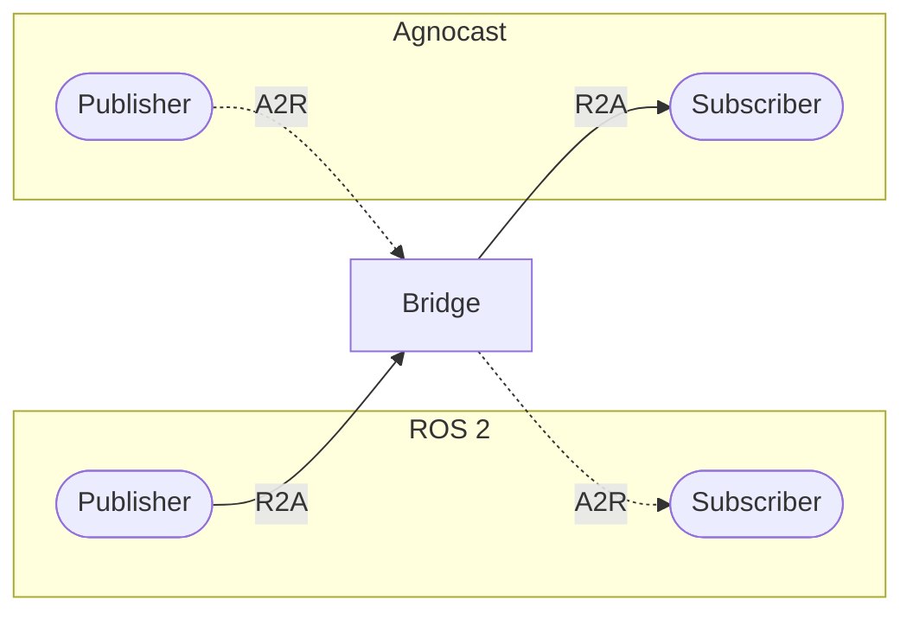
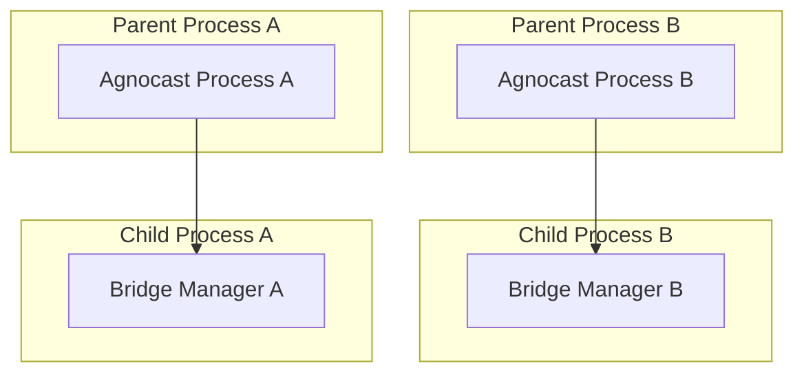
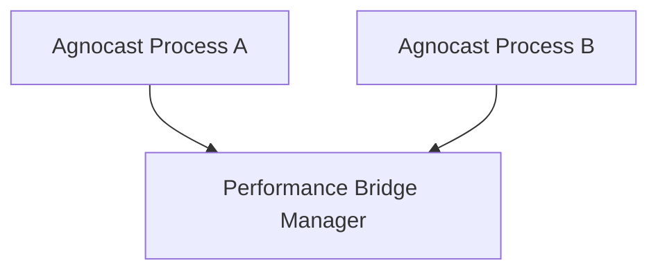
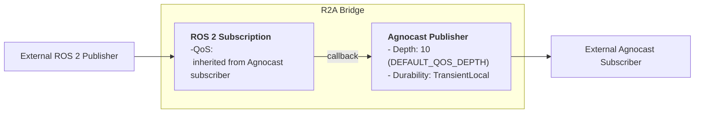
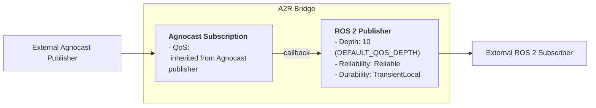

# Bridge Feature

## Overview

The Agnocast Bridge enables communication between Agnocast nodes and ROS 2 nodes. It automatically forwards messages bidirectionally.
Message circulation (echo-back) is automatically prevented by the bridge's internal logic. No additional configuration or constraints are required.

- **R2A (ROS 2 → Agnocast)**: Forwards messages from ROS 2 publishers to Agnocast subscribers
- **A2R (Agnocast → ROS 2)**: Forwards messages from Agnocast publishers to ROS 2 subscribers



## Bridge Modes

Agnocast supports three bridge modes controlled by the `AGNOCAST_BRIDGE_MODE` environment variable:

| Mode | Value | Description |
|------|-------|-------------|
| Off | `0` or `off` | Bridge disabled; no ROS 2 interoperability |
| Standard | `1` or `standard` | One bridge manager per Agnocast process (default) |
| Performance | `2` or `performance` | Single global bridge manager for all processes |

**Note:**

- Values are case-insensitive (e.g., `Standard`, `OFF`, `Performance` are valid).
- If an unknown value is provided, it falls back to Standard mode with a warning.

### Standard Mode vs Performance Mode

Standard Mode and Performance Mode have distinct trade-offs regarding resource usage, isolation, and setup complexity.

| Feature | [Standard Mode](#standard-mode-default) | [Performance Mode](#performance-mode) |
| :--- | :--- | :--- |
| Architecture | Distributed: 1 Bridge Manager per Agnocast process. | Centralized: 1 Global Bridge Manager for all processes. |
| Resource Usage | High: Increases linearly with the number of processes. | Low: Minimal overhead. Efficient for systems with many nodes. |
| Activation Strategy | Eager: Starts immediately regardless of ROS 2 status. | Lazy: Starts only when a counterpart exists ([See Conditions](#bridge-activation-conditions)). |
| Isolation & Safety | High: Bridges are isolated. If one bridge crashes, others are unaffected. | Low: Shared process. A crash in the manager affects all bridged topics. |
| Setup | Easy: No preparation needed. Works dynamically. | Complex: Requires pre-compiled plugins ([See Build](#performance-mode-build)). |

### Standard Mode (Default)

Each Agnocast process spawns its own bridge manager as a forked child process. This provides process isolation and is suitable for most use cases.



### Performance Mode

A single bridge manager handles all bridge requests across the system. This reduces resource usage when running many Agnocast processes but requires pre-compiled bridge plugins for each message type.



## Configuration

### Environment Variable

Set `AGNOCAST_BRIDGE_MODE` before launching your application:

```bash
# Standard mode (Default)
export AGNOCAST_BRIDGE_MODE=standard
# OR
export AGNOCAST_BRIDGE_MODE=1

# Performance mode
export AGNOCAST_BRIDGE_MODE=performance
# OR
export AGNOCAST_BRIDGE_MODE=2

# Disable bridge
export AGNOCAST_BRIDGE_MODE=off
```

### Using with Launch Files

```python
from launch import LaunchDescription
from launch_ros.actions import Node

def generate_launch_description():
    return LaunchDescription([
        Node(
            package='your_package',
            executable='your_node',
            name='your_node',
            env={'AGNOCAST_BRIDGE_MODE': 'standard'}
        ),
    ])
```

### Performance Mode Build

Performance mode requires pre-compiled bridge plugins. Build with:

```bash
BUILD_GENERIC_BRIDGE=ON colcon build --symlink-install --cmake-args -DCMAKE_BUILD_TYPE=Release
```

When `BUILD_GENERIC_BRIDGE=ON` is set, the build system automatically:

1. Retrieves all available message types via `ros2 interface list -m`
2. Generates R2A and A2R bridge plugins for each message type
3. Installs plugins to `lib/agnocastlib/bridge_plugins/`

> [!NOTE]
> Since plugins are generated at build time, any new custom message types added after the build will not be supported in Performance Mode until agnocastlib is rebuilt.

## Bridge Activation Conditions

Bridges are not always active. The activation conditions differ between Standard mode and Performance mode.

| Mode | Bridge Creation (Start) | Bridge Destruction (Stop) | Behavior Summary |
| :--- | :--- | :--- | :--- |
| Standard |Agnocast endpoint exists. | Agnocast endpoint removed. | Eager: Bridges are created immediately when an Agnocast node starts, regardless of whether a ROS 2 counterpart exists. |
| Performance | Agnocast endpoint and External ROS 2 endpoint exist. | Agnocast endpoint removed or External ROS 2 endpoint removed. | Lazy: Bridges are only created when there is an active pair of sender/receiver across the domains, reducing unnecessary overhead. |

## QoS Behavior

### Bridge Internal Structure

Each bridge direction creates a pair of internal publisher and subscriber.
The internal publisher's QoS is fixed to maximize compatibility, ensuring connectivity regardless of the external QoS settings.

**R2A Bridge (RosToAgnocastBridge)**:



> [!WARNING]
> In the R2A Bridge, the internal ROS 2 subscription inherits the QoS settings from the external Agnocast subscriber. <br/>
 Please ensure you avoid a QoS mismatch (specifically, a **Volatile Publisher vs. Transient Local Subscriber** scenario) during ROS 2 communication.

**A2R Bridge (AgnocastToRosBridge)**:


