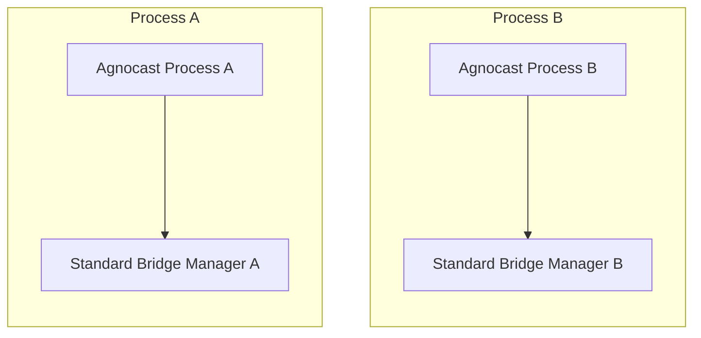
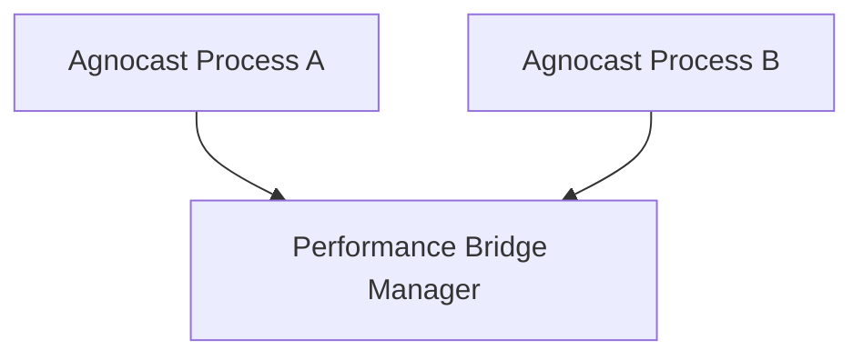
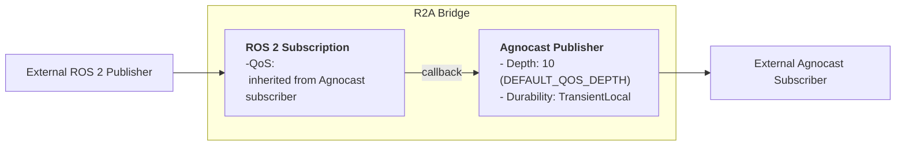
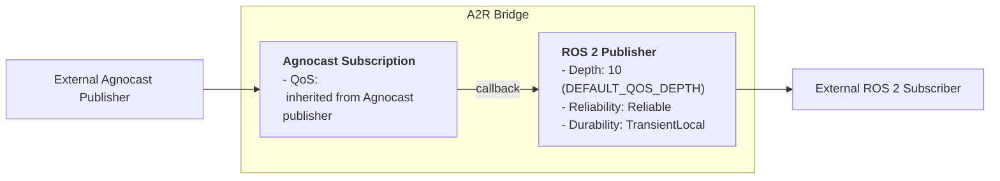

# Bridge Feature

## Overview

The Agnocast Bridge enables communication between Agnocast nodes and ROS 2 nodes. It automatically forwards messages bidirectionally while preventing message circulation (echo-back):

- **R2A (ROS 2 → Agnocast)**: Forwards messages from ROS 2 publishers to Agnocast subscribers
- **A2R (Agnocast → ROS 2)**: Forwards messages from Agnocast publishers to ROS 2 subscribers


## Bridge Modes

Agnocast supports three bridge modes controlled by the `AGNOCAST_BRIDGE_MODE` environment variable:

| Mode | Value | Description |
|------|-------|-------------|
| **Off** | `0` or `off` | Bridge disabled; no ROS 2 interoperability |
| **Standard** | `1` or `standard` | One bridge manager per Agnocast process (default) |
| **Performance** | `2` or `performance` | Single global bridge manager for all processes |

**Note:**

- Values are **case-insensitive** (e.g., `Standard`, `OFF`, `Performance` are valid).
- If an unknown value is provided, it falls back to **Standard** mode with a warning.

### Standard Mode (Default)

Each Agnocast process spawns its own bridge manager as a forked child process. This provides process isolation and is suitable for most use cases.



### Performance Mode

A single bridge manager handles all bridge requests across the system. This reduces resource usage when running many Agnocast processes but requires pre-compiled bridge plugins for each message type.



## Configuration

### Environment Variable

Set `AGNOCAST_BRIDGE_MODE` before launching your application:

```bash
# Standard mode (Default)
export AGNOCAST_BRIDGE_MODE=standard
# OR
export AGNOCAST_BRIDGE_MODE=1

# Performance mode
export AGNOCAST_BRIDGE_MODE=performance
# OR
export AGNOCAST_BRIDGE_MODE=2

# Disable bridge
export AGNOCAST_BRIDGE_MODE=off
```

### Using with Launch Files

```python
from launch import LaunchDescription
from launch_ros.actions import Node

def generate_launch_description():
    return LaunchDescription([
        Node(
            package='your_package',
            executable='your_node',
            name='your_node',
            env={'AGNOCAST_BRIDGE_MODE': 'standard'}
        ),
    ])
```

### Performance Mode Build

Performance mode requires pre-compiled bridge plugins. Build with:

```bash
BUILD_GENERIC_BRIDGE=ON colcon build --symlink-install --cmake-args -DCMAKE_BUILD_TYPE=Release
```

When `BUILD_GENERIC_BRIDGE=ON` is set, the build system automatically:

1. Retrieves all available message types via `ros2 interface list -m`
2. Generates R2A and A2R bridge plugins for each message type
3. Installs plugins to `lib/agnocastlib/bridge_plugins/`

## Bridge Activation Conditions

Bridges are **not** always active. The activation conditions differ between Standard mode and Performance mode.

### Standard Mode

In Standard mode, the bridge is activated when an Agnocast endpoint sends a bridge request. The bridge manager checks endpoint existence via the kernel module.

| Bridge Direction | Activation Condition |
|------------------|---------------------|
| R2A (ROS 2 → Agnocast) | Agnocast subscriber exists (checked via kernel) |
| A2R (Agnocast → ROS 2) | Agnocast publisher exists (checked via kernel) |

**Removal conditions**:

- R2A: Removed when Agnocast subscriber count becomes 0
- A2R: Removed when Agnocast publisher count becomes 0

### Performance Mode

In Performance mode, the bridge manager additionally checks for external ROS 2 endpoints before creating a bridge.

| Bridge Direction | Activation Condition |
|------------------|---------------------|
| R2A (ROS 2 → Agnocast) | Agnocast subscriber exists **AND** external ROS 2 publisher exists |
| A2R (Agnocast → ROS 2) | Agnocast publisher exists **AND** external ROS 2 subscriber exists |

**Removal conditions**:

- R2A: Removed when Agnocast subscriber count becomes 0 **OR** no external ROS 2 publisher exists
- A2R: Removed when Agnocast publisher count becomes 0 **OR** no external ROS 2 subscriber exists

## QoS Behavior

### Bridge Internal Structure

Each bridge direction creates a pair of internal publisher and subscriber:

**R2A Bridge (RosToAgnocastBridge)**:



> **Note:** <br/>
 In the R2A Bridge, the internal ROS 2 subscription inherits the QoS settings from the external Agnocast subscriber. <br/>
 Please ensure you avoid a QoS mismatch (specifically, a **Volatile Publisher vs. Transient Local Subscriber** scenario) during ROS 2 communication.

**A2R Bridge (AgnocastToRosBridge)**:



### QoS Settings Summary

| Bridge | Internal Component | Depth | Reliability | Durability |
|--------|-------------------|-------|-------------|------------|
| R2A | ROS 2 Subscription | inherited | inherited | inherited |
| R2A | Agnocast Publisher | 10 | - | TransientLocal |
| A2R | Agnocast Subscription | inherited | inherited | inherited |
| A2R | ROS 2 Publisher | 10 | Reliable | TransientLocal |
