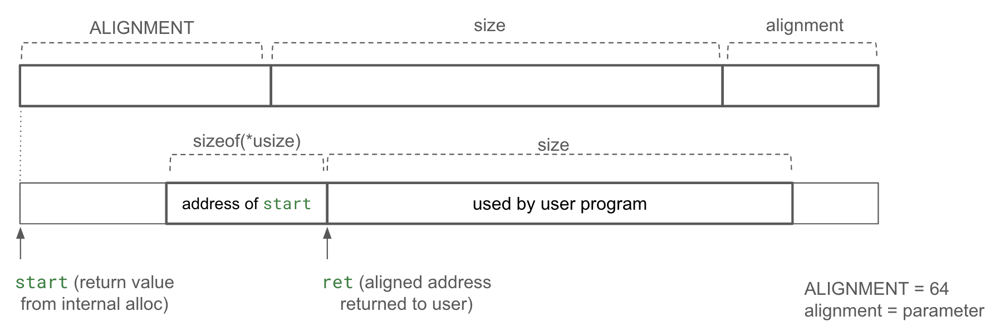

# Memory format for lockless aligned-allocation in heaphook

This document defines a memory format for providing `aligned_alloc` functionality to user programs when using the internal allocator library (currently, the TLSF allocator).
A critical requirement is lockless operation for performance optimization.

When a user program calls `aligned_alloc(size, alignment)`, the internal allocator's allocation function is called with a size of `POINTER_SIZE + size + alignment`.
The pointer returned by the internal allocator is defined as `original_ptr`.
The aligned pointer provided to the user program, `aligned_ptr`, is calculated as `aligned_ptr = (original_ptr + POINTER_SIZE + alignment - 1) & !(alignment - 1);`.
This ensures that `aligned_ptr` is aligned to `alignment` and the memory region provided to the user program fits within the initially allocated area from the internal allocator.
Additionally, the pointer value is stored at the location indicated by `aligned_ptr - POINTER_SIZE`.

When the user program calls `free()`, `aligned_ptr` is passed as the argument.
At this point, the pointer value to be passed to the internal allocator's `free()` function can be calculated as `*(aligned_ptr - POINTER_SIZE)`.
