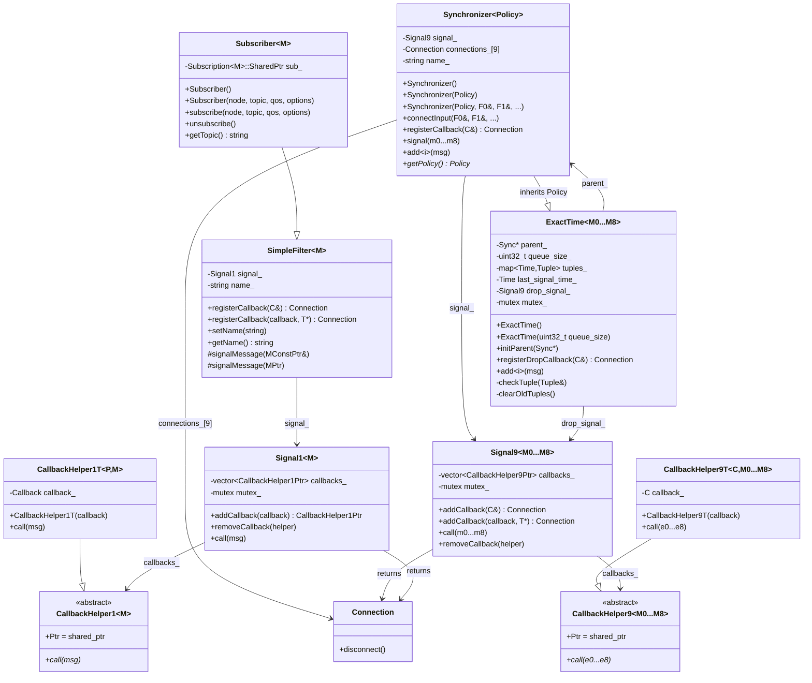

# agnocast::message_filters 設計ドキュメント

## 概要

`agnocast::message_filters` は、複数のトピックからのメッセージを時刻同期して処理するためのライブラリです。ROS2の `message_filters` パッケージと互換性のあるAPIを提供しつつ、agnocast独自の `ipc_shared_ptr` を使用したゼロコピー通信に対応しています。

---

## 全体アーキテクチャ


## クラス構成図



---

## コンポーネントの役割

### CallbackHelper9 / CallbackHelper9T

**役割:** 型消去（Type Erasure）パターンによるコールバック抽象化

異なるパラメータ数のコールバック（2引数、3引数、...9引数）を同一のコンテナに格納するための基底クラスと派生クラスです。

| クラス | 役割 |
|--------|------|
| `CallbackHelper9<M0...M8>` | 純粋仮想基底クラス。`call()` メソッドを定義 |
| `CallbackHelper9T<C, M0...M8>` | 実際のコールバック `C` を保持する派生クラス |

**なぜ必要か:**
- 異なる型のコールバック（ラムダ、関数ポインタ、メンバ関数）を統一的に扱う
- `std::vector<CallbackHelper9::Ptr>` で異なる型のコールバックを格納可能
- ROS2 の `message_filters` と同じ設計パターン

---

### Signal9<M0...M8>

**役割:** 9メッセージ用シグナル/スロットパターンによるコールバック管理

複数のコールバックを登録・管理し、一括で呼び出す機能を提供します。`CallbackHelper9` を使った型消去により、異なるシグネチャのコールバックを統一的に扱います。

| メンバ/メソッド | 役割 |
|---------------|------|
| `callbacks_` | `CallbackHelper9Ptr` のベクタ（型消去されたコールバック） |
| `mutex_` | スレッドセーフなコールバック操作を保証 |
| `addCallback(C&)` | ラムダ/関数オブジェクトをコールバックとして登録 |
| `addCallback(callback, T*)` | メンバ関数をコールバックとして登録 |
| `call()` | 登録済みの全コールバックを順次呼び出し |
| `removeCallback()` | 特定のコールバックをリストから削除 |

---

### CallbackHelper1 / CallbackHelper1T

**役割:** 単一メッセージ用の型消去パターン

`Signal9` と同様の設計で、単一メッセージのコールバックを扱います。

| クラス | 役割 |
|--------|------|
| `CallbackHelper1<M>` | 純粋仮想基底クラス。`call(msg)` を定義 |
| `CallbackHelper1T<P, M>` | 実際のコールバックを保持する派生クラス |

---

### Signal1<M>

**役割:** 単一メッセージ用シグナル/スロットパターン

`SimpleFilter` の内部で使用され、単一メッセージのコールバック管理を行います。

| メンバ/メソッド | 役割 |
|---------------|------|
| `callbacks_` | `CallbackHelper1Ptr` のベクタ |
| `addCallback()` | コールバックを登録し、`CallbackHelper1Ptr` を返す |
| `removeCallback()` | コールバックを削除 |
| `call()` | 全コールバックを呼び出し |

---

### SimpleFilter<M>

**役割:** フィルターの基底クラス

`Subscriber` 等のフィルタークラスの基底となり、コールバック登録機能を提供します。ROS2 の `message_filters::SimpleFilter` と同じ API を持ちます。

| メンバ/メソッド | 役割 |
|---------------|------|
| `signal_` | `Signal1<M>` インスタンス |
| `registerCallback()` | コールバックを登録し `Connection` を返す |
| `signalMessage()` | 派生クラスから呼び出し、登録済みコールバックを発火 |
| `setName() / getName()` | デバッグ用の名前設定・取得 |

---

### Subscriber<M>

**役割:** agnocast サブスクリプションをフィルターとしてラップ

`agnocast::create_subscription` を内部で使用し、受信したメッセージを `SimpleFilter` 経由で `Synchronizer` に渡します。

| メンバ/メソッド | 役割 |
|---------------|------|
| `sub_` | `agnocast::Subscription<M>::SharedPtr` |
| `subscribe()` | サブスクリプションを開始 |
| `unsubscribe()` | サブスクリプションを停止 |
| `getTopic()` | トピック名を取得 |

**使用例:**
```cpp
agnocast::message_filters::Subscriber<sensor_msgs::msg::Imu> sub(
    node, "imu_topic", rclcpp::QoS(10));
```

---

### Synchronizer<Policy>

**役割:** メッセージ同期のファサード（窓口）クラス

ユーザーが直接操作するメインクラスです。ポリシーを継承し、シグナルを保持してメッセージの受信からコールバック呼び出しまでの全体フローを統括します。

| メンバ/メソッド | 役割 |
|---------------|------|
| `signal_` | 複数のユーザーコールバックを管理する Signal9 インスタンス |
| `connections_[9]` | フィルター（Subscriber等）との接続を管理 |
| `connectInput()` | 外部フィルターからのメッセージ受信を設定 |
| `registerCallback()` | 同期完了時に呼ばれるユーザーコールバックを登録 |
| `add<i>()` | i番目のメッセージを手動で追加（フィルター未使用時） |
| `signal()` | ポリシーから呼び出され、登録済みコールバックを発火 |
| `getPolicy()` | ポリシーへの直接アクセス（drop callback登録等） |

---

### ExactTime\<M0...M8\>

**役割:** 完全一致タイムスタンプによる同期ポリシー

全てのメッセージが**完全に同じタイムスタンプ**を持つ場合にのみコールバックを発火します。センサーフュージョン等、厳密な時刻同期が必要な場合に使用します。

| メンバ/メソッド | 役割 |
|---------------|------|
| `parent_` | 親Synchronizerへのポインタ（signal呼び出し用） |
| `queue_size_` | 保持する未完成タプルの最大数 |
| `tuples_` | タイムスタンプをキーとしたメッセージタプルのマップ |
| `drop_signal_` | キューオーバーフロー時のドロップコールバック管理 |
| `add<i>()` | i番目のメッセージを受け取り、タプルに格納 |
| `checkTuple()` | タプルが完成したかチェックし、完成なら signal 発火 |
| `clearOldTuples()` | 古い（処理済み時刻以前の）タプルを削除 |
| `registerDropCallback()` | メッセージドロップ時のコールバックを登録 |

**内部動作:**
1. メッセージ受信 → タイムスタンプで `tuples_` に格納
2. タプル内の全スロットが埋まったら `parent_->signal()` 呼び出し
3. キューサイズ超過時は古いタプルを削除し `drop_signal_` 発火

---

### Connection

**役割:** コールバック接続のライフサイクル管理

`registerCallback()` の戻り値として返され、`disconnect()` を呼ぶことでコールバックを解除できます。ROS2 の `message_filters::Connection` を再利用しています。

| メソッド | 役割 |
|---------|------|
| `disconnect()` | 関連付けられたコールバックを Signal から削除 |

**使用例:**
```cpp
auto conn = sync.registerCallback(myCallback);
// ... 処理 ...
conn.disconnect();  // コールバック解除
```

---

### NullFilter\<M\>

**役割:** 何もしないダミーフィルター

`connectInput()` で9個未満のフィルターを渡した場合、残りのスロットを埋めるために使用されます。`registerCallback()` は何もせず空の `Connection` を返します。ROS2 の実装を再利用しています。

---

## データフロー


## 型消去パターンの動作


## connectInput の動作


## Connection によるコールバック管理


## ExactTime ポリシーの内部動作


## ros2/message_filters との API 対応表


## ファイル構成


## 新規追加ファイル一覧

| ファイル | 内容 | 状態 |
|---------|------|------|
| `signal1.hpp` | CallbackHelper1, CallbackHelper1T, Signal1 | **新規** |
| `signal9.hpp` | CallbackHelper9, CallbackHelper9T, Signal9 | **新規** |
| `simple_filter.hpp` | SimpleFilter 基底クラス | **新規** |
| `subscriber.hpp` | Subscriber フィルター | **新規** |
| `synchronizer.hpp` | Synchronizer, PolicyBase | **新規** |
| `sync_policies/exact_time.hpp` | ExactTime ポリシー | **新規** |

---

## 使用例

### Subscriber を使った同期（推奨）

```cpp
#include "agnocast/message_filters/subscriber.hpp"
#include "agnocast/message_filters/sync_policies/exact_time.hpp"

using namespace agnocast::message_filters;

// 型定義
using Policy = sync_policies::ExactTime<
    sensor_msgs::msg::Imu,
    sensor_msgs::msg::Imu>;
using Sync = Synchronizer<Policy>;

class MyNode : public rclcpp::Node {
public:
    MyNode() : Node("my_node"),
        // Reentrant callback group（マルチスレッド対応）
        callback_group_(create_callback_group(rclcpp::CallbackGroupType::Reentrant)),
        // Subscriber 作成
        sub1_(this, "imu_topic1", rclcpp::QoS(10),
              agnocast::SubscriptionOptions{callback_group_}),
        sub2_(this, "imu_topic2", rclcpp::QoS(10),
              agnocast::SubscriptionOptions{callback_group_}),
        // Synchronizer 作成（コンストラクタで接続）
        sync_(Policy(10), sub1_, sub2_)
    {
        // コールバック登録
        sync_.registerCallback(
            std::bind(&MyNode::callback, this,
                      std::placeholders::_1, std::placeholders::_2));
    }

private:
    void callback(
        const agnocast::ipc_shared_ptr<const sensor_msgs::msg::Imu>& msg1,
        const agnocast::ipc_shared_ptr<const sensor_msgs::msg::Imu>& msg2)
    {
        RCLCPP_INFO(get_logger(), "Synchronized!");
    }

    rclcpp::CallbackGroup::SharedPtr callback_group_;
    Subscriber<sensor_msgs::msg::Imu> sub1_;
    Subscriber<sensor_msgs::msg::Imu> sub2_;
    Sync sync_;
};
```

### 手動メッセージ追加

```cpp
using Policy = sync_policies::ExactTime<
    sensor_msgs::msg::Image,
    sensor_msgs::msg::CameraInfo>;
using Sync = Synchronizer<Policy>;

// Synchronizer 作成
Sync sync{Policy(10)};  // queue_size = 10

// コールバック登録
sync.registerCallback([](
    const agnocast::ipc_shared_ptr<const sensor_msgs::msg::Image>& image,
    const agnocast::ipc_shared_ptr<const sensor_msgs::msg::CameraInfo>& info) {
    processImageWithInfo(image, info);
});

// メッセージを手動で追加
sync.add<0>(image_msg);
sync.add<1>(camera_info_msg);
```

### ドロップコールバックの使用

```cpp
Sync sync{Policy(2)};  // 小さいキューサイズ

sync.registerCallback(processCallback);

// キューオーバーフロー時のコールバック
sync.getPolicy()->registerDropCallback([](auto& img, auto& info) {
    RCLCPP_WARN(logger, "Message dropped due to queue overflow");
});
```

### Connection によるコールバック解除

```cpp
auto connection = sync.registerCallback(myCallback);

// ... 処理 ...

// コールバック解除
connection.disconnect();
```

---

## 設計上の考慮点

### ros2/message_filters との互換性

- **API互換:** 同じメソッド名・シグネチャを提供
- **型の違い:** `std::shared_ptr` → `ipc_shared_ptr`（ゼロコピー対応）
- **設計パターン:** `CallbackHelper` による型消去パターンを採用
- **未実装:** `ApproximateTime` ポリシー

### スレッドセーフティ

- `Signal1 / Signal9`: `mutex_` で保護されたコールバックリスト
- `ExactTime`: `mutex_` で保護されたタプルマップ
- 複数スレッドからの同時メッセージ追加に対応
- `Reentrant` callback group の使用を推奨

### メモリ管理

- `Connection` による明示的なコールバック解除
- `queue_size_` による未完成タプルの上限管理
- `clearOldTuples()` による古いデータの自動クリーンアップ
- `ipc_shared_ptr` によるゼロコピーメッセージ共有
