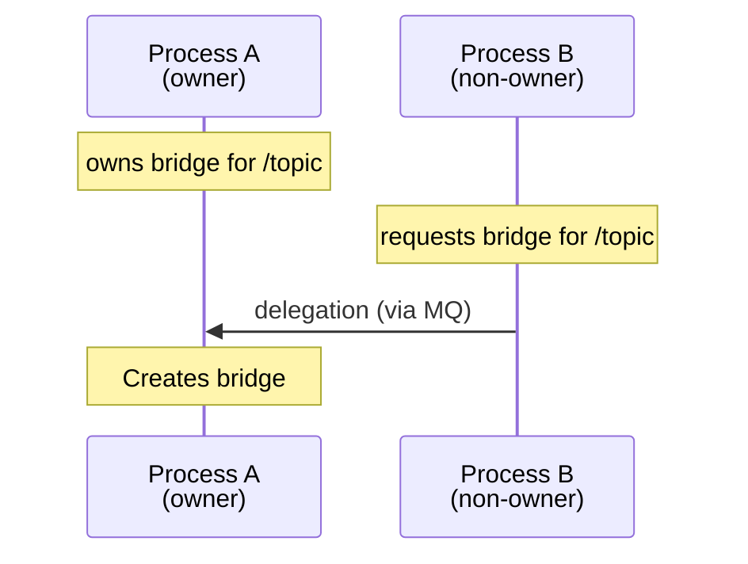

## What is message queue in Linux?

See official man page: <https://man7.org/linux/man-pages/man7/mq_overview.7.html>

## How message queue is used in Agnocast?

The message queue is used to notify to subscriber processes that a publisher has published a new topic message. It is done in the following way:

- When a subscriber process calls `create_subscription` for a topic `T`, it opens a new message queue as a receiver.
- When a publisher process calls `publish` for `T`, it opens an existing message queue and sends a message to notify to the subscribers that a new topic message has been published.
- When a subscriber process receives the notification, then it gets the topic content through `AGNOCAST_RECEIVE_MSG_CMD` ioctl and executes the corresponding callback.

The definition of the message is an empty struct:

```c
struct MqMsgAgnocast {};
```

We deliberately send it as a zero-length message although the size of this struct cannot be zero according to the C++ specification. Upon receiving this message, the subscriber needs to use an ioctl call to query the kernel module to check if there is anything that should be received.

### Naming rules and restrictions

The message_queue is named using topic_local_id. As implied by its name, topic_local_id exists in a topic-local namespace and represents IDs that are incrementally assigned from 0 to publishers/subscribers. This was introduced to distinguish between different publishers/subscribers that exist within the same process and participate in the same topic, and we use it here as well.
Suppose that `topic_local_id` is the topic_local_id of the subscriber who opens the message queue and `topic_name` is the topic name corresponding to the message queue.

- The message queue name for the topic publish notification is `/agnocast@topic_name@topic_local_id`.

The restrictions of the naming are

- The topic name must start with `/`,
- and, it must not include `/` other than the beginning.

The first rule is satisfied because all topic names start with `/`.
To satisfy the second rule, all the occurrence of `/` in topic names are replaced for `_`.

## How message queue is used in Agnocast Bridge?

The message queue is also used for communication between Agnocast processes and Bridge Manager processes. When an Agnocast publisher or subscriber is created, it sends a bridge request to the Bridge Manager via message queue.

### Standard Mode

In Standard mode, each Agnocast process forks its own Bridge Manager. The message queue is used as follows:

- When an Agnocast process starts, it forks a Bridge Manager child process. The Bridge Manager opens a message queue as a receiver.
- When an Agnocast publisher calls `create_publisher`, it sends a bridge request (A2R direction) to the Bridge Manager's message queue.
- When an Agnocast subscriber calls `create_subscription`, it sends a bridge request (R2A direction) to the Bridge Manager's message queue.
- Upon receiving the request, the Bridge Manager creates the appropriate bridge if conditions are met.

The message definition for Standard mode contains factory function information:

```cpp
struct MqMsgBridge {
  BridgeFactoryInfo factory;  // shared library path, symbol name, function offsets
  BridgeTargetInfo target;    // topic name, target ID
  BridgeDirection direction;  // ROS2_TO_AGNOCAST or AGNOCAST_TO_ROS2
};
```

### Performance Mode

In Performance mode, a single global Bridge Manager handles all bridge requests. The message queue is used as follows:

- The first Agnocast process spawns a global Performance Bridge Manager that opens a message queue as a receiver.
- All Agnocast processes send bridge requests to this shared message queue.
- The Performance Bridge Manager loads pre-compiled plugins based on the message type.

The message definition for Performance mode is simpler:

```cpp
struct MqMsgPerformanceBridge {
  char message_type[256];     // e.g., "std_msgs/msg/String"
  BridgeTargetInfo target;    // topic name, target ID
  BridgeDirection direction;  // ROS2_TO_AGNOCAST or AGNOCAST_TO_ROS2
};
```

### Naming rules

The Bridge Manager message queue is named using the process ID:

| Mode | Message Queue Name | Description |
|------|-------------------|-------------|
| Standard | `/agnocast_bridge_manager@{pid}` | `{pid}` is the Bridge Manager's PID |
| Performance | `/agnocast_bridge_manager@-1` | Uses virtual PID `-1` for the global manager |

### Delegation in Standard Mode

When multiple Agnocast processes request bridges for the same topic, only one Bridge Manager owns the bridge (enforced by the kernel module). If a non-owner Bridge Manager receives a request for an already-owned topic, it delegates the request to the owner's message queue.



For detailed information, see [Bridge Documentation](./docs/bridge.md).
